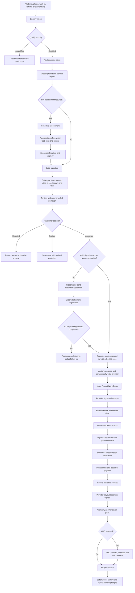
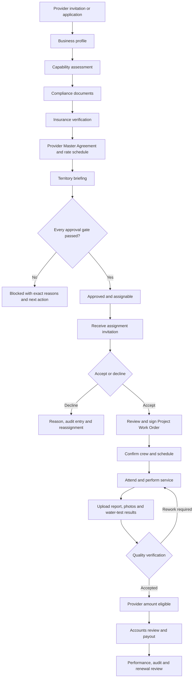

# Water Tank Services Product Assessment and Production Plan

**Product:** Seventh Sky Property Care  
**Module:** Water Tank Services  
**Console:** `/admin/water-tank/`  
**Assessment date:** 12 August 2026  
**Prepared as:** Senior product, UX, workflow, architecture, security, and production-readiness assessment

---

## 1. Executive Summary

The Water Tank Services module has broad functional coverage and a strong visual foundation. It already contains dedicated areas for clients, enquiries, service requests, assessments, quotations, agreements, projects, work orders, providers, compliance, service reports, AMC contracts, invoices, receipts, provider disbursements, warranties, complaints, incidents, communication, and catalogue reference data.

It is not yet production-ready.

The primary remaining risk is no longer a lack of screens. The risk is that several screens and APIs can change the same business state through different paths with different validation, authorization, audit, and financial behavior. A polished interface must not sit on top of unsafe lifecycle or financial mutations.

The recommended order is:

1. Fix security, signing, runtime, authorization, transaction, and data-integrity blockers.
2. Establish one authoritative API and state machine for every entity.
3. Establish one authoritative money ledger and calculation engine.
4. Make `water_tank_csa` the canonical editable catalogue.
5. Simplify navigation and complete responsive and accessible UX.
6. Add focused customer and provider self-service portals.
7. Add automated tests, operational monitoring, reconciliation, backups, and staged release controls.

### Current maturity estimate

| Dimension | Assessment |
|---|---:|
| Functional coverage | 8/10 |
| Desktop visual design | 7/10 |
| End-to-end workflow integrity | 4/10 |
| Security and permissions | 3/10 |
| Financial control and reconciliation | 4/10 |
| Mobile and accessibility | 4/10 |
| Automated testing | 1/10 |
| Overall production readiness | 4/10 |

---

## 2. Assessment Basis and Limitations

This assessment was produced from:

- The Water Tank frontend source under `admin-portal/src/screens/watertank/`.
- Water Tank routes in `admin-portal/src/App.jsx`.
- Water Tank styling in `admin-portal/src/styles/wt-scope.css`.
- Related navigation in `admin-portal/src/ui/Layout.jsx`.
- Backend Water Tank controllers, routes, services, models, and migrations.
- The shared signing engine and agreement-completion automation.
- Service catalogue and financial calculation code.
- The project architecture and persistent agent work log.
- Static end-to-end tracing of the operational lifecycle.

Observed runtime availability during the assessment:

- `http://localhost:3005/admin/water-tank/` returned HTTP 200.
- `http://localhost:50001/api/health` returned HTTP 200.

Limitations:

- HTTP 200 confirms service availability, not workflow correctness.
- The final authenticated browser click-through was not performed during this assessment.
- The browser automation binary was unavailable.
- The worktree contains substantial uncommitted concurrent work.
- Static findings must be revalidated immediately before implementation because other contributors may continue changing these files.

---

## 3. Current Product Inventory

### 3.1 Staff console

The Water Tank module currently uses a dedicated navy-and-cyan console separate from the global admin shell.

Current sidebar destinations:

1. Dashboard
2. Clients
3. Service Requests
4. Site Assessments
5. Quotations
6. Work Orders
7. Projects
8. Providers
9. Agreements
10. Compliance & Audits
11. Service Reports
12. AMC
13. Invoices
14. Payments & Disbursements
15. Warranty & Issues
16. Complaints
17. Communication Log
18. Settings

### 3.2 Current core routes

| Area | Current routes |
|---|---|
| Dashboard | `/water-tank` |
| Clients | `/clients`, `/clients/new`, `/clients/:code` |
| Service requests | `/service-requests`, `/service-requests/new` |
| Assessments | `/site-assessments`, `/new`, `/:code`, `/:code/edit`, `/:code/quotation` |
| Quotations | `/quotations`, `/new`, `/:code`, `/:code/edit`, `/:code/agreement` |
| Work orders | `/work-orders`, `/:code`, `/:code/edit`, `/:code/document` |
| Projects | `/projects`, `/new`, `/:code`, `/:code/edit` |
| Providers | `/providers`, `/new`, `/:id`, `/:code/edit` |
| Agreements | `/water-tank/agreements` plus `/agreements/water-tank-*` routes |
| Compliance | `/compliance`, `/reports` |
| AMC | `/amc`, `/amc/create-amc` |
| Finance | `/invoices`, `/invoices/:code`, `/payments` |
| Aftercare | `/registers`, `/complaints`, `/communication` |
| Configuration | `/settings` |
| Public provider onboarding | `/water-tank-provider-onboard/:token` |

### 3.3 Existing functional coverage

The current implementation contains most of the operational backbone:

- Public and staff-created enquiry intake.
- Enquiry qualification and conversion.
- Client lookup and creation.
- Central Water Tank identifiers and project linkage.
- Assessment scheduling and seven-step assessment entry.
- Safety checklists, water quality, risks, variations, photos, sign-off, and comments.
- Direct quotation or assessment-led quotation.
- Editable quotation rates with branded preview, PDF, and email.
- Customer and provider agreements using the shared eSign engine.
- Provider onboarding, compliance, insurance, agreement, territory, and assignability gates.
- Project dashboards and timelines.
- Work-order creation, provider assignment, progress, documentation, delivery, and verification.
- Invoice creation and payment-stage support.
- Client receipts and provider payouts.
- AMC contract and visit support.
- Warranty, complaint, incident, and communication registers.
- A console-wide command palette.

This is a valuable foundation. The production plan should consolidate it rather than replace it wholesale.

---

## 4. Target End-to-End Customer Journey



### Customer-flow requirements

- Never create duplicate clients when an existing contact or Water Tank client matches.
- Every enquiry conversion must retain the original enquiry reference and channel.
- The project file must be the operational spine connecting all downstream records.
- Assessment requirements should be suggested by the catalogue and overridable only with a reason.
- A quotation must retain a pricing snapshot even when catalogue prices later change.
- Work should not proceed without the required signed customer agreement.
- Agreement completion must create downstream records exactly once.
- Customer receipts must be recorded against an immutable ledger.
- Closure must require financial, documentation, warranty, complaint, and satisfaction checks.

---

## 5. Target End-to-End Provider Journey



### Provider-flow requirements

- Approval and assignability are different states and should remain distinct.
- A provider must have valid compliance, insurance, agreement, rate, and territory evidence.
- Work-order pricing must use a signed commercial snapshot, not a mutable current rate.
- A provider should accept or decline assignments through their own authenticated portal.
- Completion requires evidence and Seventh Sky verification.
- Provider payout must be blocked until the signed commercial trigger is met.
- Provider performance should be derived from real work, complaints, warranties, audits, acceptance, and response time.

---

## 6. Critical Production Blockers

The following findings were identified during the source audit and must be revalidated and resolved before production.

### P0/P1 security and integrity findings

1. **Project creation runtime failure**
   - `backend/services/wtProject.service.js` references `prIn` in `createProject()` without defining it.
   - Impact: project creation may fail at runtime even though syntax checking succeeds.

2. **Signing-order bypass**
   - `backend/controllers/signing.controller.js` enforces signing order on document view but not when a token submits a signature.
   - Impact: a later signer can bypass an earlier signer by directly posting the token.

3. **Signing-token exposure**
   - Agreement and work-order staff APIs expose live signer access tokens.
   - Impact: any user with API access could impersonate a signer.

4. **Work-order activation scope error**
   - `backend/services/partyRoleActivation.service.js` references `P.WtProviderEvent` in a scope where `P` is not defined.
   - Impact: agreement completion can fail to finish operational activation cleanly.

5. **Generic lifecycle bypass**
   - `/api/wt-ops/:entity` exposes generic create, patch, delete, and advance operations for domain entities that also have specialist controllers.
   - Impact: quotation, agreement, work-order, AMC, invoice, and provider gates can be bypassed.

6. **Unwhitelisted request writes**
   - `backend/controllers/waterTankOps.controller.js` spreads request bodies into model writes.
   - Impact: callers can mutate fields that should be derived, protected, or controlled by named actions.

7. **Insufficient route authorization**
   - Many Water Tank routes require authentication but do not enforce role permissions.
   - Impact: unrelated authenticated roles may perform agreements, lifecycle, receipts, payouts, and destructive actions.

8. **Competing financial authorities**
   - Generic Water Tank operations and dedicated invoice endpoints both mutate receipts and payout state.
   - Impact: invoice status, payment ledger, outstanding balance, and payout state can disagree.

9. **Non-transactional money movement**
   - Receipt and payout handlers use read-modify-write patterns without row locks, immutable ledger rows, or idempotency keys.
   - Impact: double-clicks, retries, or concurrent users can double-record money or lose updates.

10. **Public branch trust**
    - Public Water Tank enquiry intake accepts branch selection from the caller.
    - Impact: a public caller may route data into an arbitrary branch.

11. **Identifier uniqueness conflict**
    - Codes are generated per branch while some database columns are globally unique.
    - Impact: a second branch can generate an existing code and fail.

12. **Missing signature anchors in Project Work Orders**
    - Signature fields exist, but the work-order HTML lacks stable document anchors for signature placement.
    - Impact: the executed document may retain blank signature lines.

13. **Missing client identity in automatic invoices**
    - Agreement terms may omit sufficient client identity, causing invoice generation to fall back to a generic name.
    - Impact: legally and financially ambiguous invoices.

14. **Unsafe direct deletion**
    - Several register row actions delete records immediately or with inconsistent confirmation.
    - Impact: loss of auditable operational, legal, or financial records.

### Required blocker remediation

- Fix runtime reference errors and add execution tests.
- Apply signing-order validation inside the signature transaction.
- Never return raw signer tokens in normal staff-list or detail APIs.
- Restrict signing links to purpose-specific copy/send actions with explicit permission and audit.
- Disable generic writes for specialist entities.
- Whitelist every request field.
- Apply branch scoping to every read and write.
- Apply the approved strict role matrix.
- Make state transitions transactional and idempotent.
- Introduce immutable receipt and payout ledger rows.
- Derive public branch routing from trusted server configuration.
- Choose globally unique codes or composite `(branch_id, code)` uniqueness consistently.
- Add stable signature anchors and freeze the signature-injected executed HTML.
- Prevent deletion of issued, signed, paid, completed, or referenced records.
- Prefer void, cancel, archive, or supersede actions with reasons.

---

## 7. Canonical State Machines

Generic status dropdowns should not control legal, financial, or operational milestones. Named backend actions must own transitions.

### Enquiry

```text
New -> Contacted -> Qualified -> Converted
  \-> Unqualified
```

### Assessment

```text
Draft -> Scheduled -> In Progress -> Completed -> Scope Confirmed
                    \-> Cancelled
```

### Quotation

```text
Draft -> Sent -> Viewed -> Approved
                     \-> Rejected
                     \-> Expired -> Superseded
```

### Agreement

```text
Draft -> Sent -> Viewed -> Partially Signed -> Completed
   \-> Voided                  \-> Declined
```

### Work order

```text
Draft -> Issued -> Signed -> Assigned -> Accepted -> Scheduled
                                                  -> In Progress
                                                  -> Completed
                                                  -> Verified
                                                  -> Invoiced
                                                  -> Closed

Assigned -> Declined -> Reassignment
Any permitted pre-completion state -> Cancelled
```

### Invoice

```text
Draft -> Sent -> Viewed -> Partially Paid -> Paid
                 \-> Overdue
Draft/Sent -> Void
```

### AMC contract

```text
Draft -> Active -> Expiring -> Renewed
              \-> Completed
              \-> Suspended
              \-> Cancelled
```

### Project

```text
Intake -> Assessment -> Quotation -> Agreement -> Provider Assignment
       -> Service Delivery -> Verification -> Billing -> Aftercare -> Closed
```

### Transition contract

Every transition must:

- Validate the source state.
- Validate the actor's role.
- Validate all business gates.
- Run in a database transaction.
- Lock affected financial or lifecycle rows when required.
- Record an immutable audit event.
- Return blockers and the next recommended action.
- Be idempotent under retry.
- Reject stale concurrent updates.

---

## 8. Financial and Calculation Model

### 8.1 Canonical formulas

```text
line amount          = quantity x agreed unit rate
subtotal             = sum(service + material + labour + approved other lines)
discounted base      = subtotal - approved discount
taxable base         = sum(taxable lines and taxable fees)
VAT                  = taxable base x configured VAT rate
contract total       = discounted base + VAT + government fees
invoice outstanding  = invoice total - allocated receipts - applicable advance
provider gross       = signed provider rate x verified quantity
provider commission  = provider gross x signed commission rate
provider due         = provider gross - commission - retention - penalties - prior payouts
gross margin         = revenue excluding VAT - provider cost - internal/material cost
```

### 8.2 Calculation rules

- All authoritative calculations run server-side.
- The frontend may preview calculations but must replace them with server-confirmed totals after save.
- Use decimal-safe arithmetic and round only at defined boundaries.
- Never use floating-point values as the authoritative accounting record.
- Advances reduce outstanding balance, not contract value.
- VAT must be configurable by tax class rather than hardcoded.
- Discounts require a reason and permission threshold.
- Variations require approval and must update the contractual and billing position.
- Provider rates and commission must come from a signed commercial agreement snapshot.
- Invoice payments and provider payouts must create immutable ledger entries.
- Voids and reversals create compensating entries; they do not erase history.
- AMC instalments must reconcile exactly to contract value.
- Any rounding residual belongs on the final AMC instalment.
- Every financial document must include client identity, branch identity, currency, tax information, references, and issue date.

### 8.3 Single financial authority

The dedicated invoice service should be the only authority for:

- Invoice creation and totals.
- Sending and freezing invoice snapshots.
- Receipt allocation.
- Outstanding balance.
- Partial and full payment state.
- Voids and replacement invoices.

The provider commercial and payout service should be the only authority for:

- Signed rate matching.
- Gross provider value.
- Commission and deductions.
- Payout eligibility.
- Partial and final payouts.
- Remittance references.

The generic `/wt-ops` controller must not mutate these values.

---

## 9. Service Catalogue Assessment

### Current issue

Two Water Tank verticals compete:

- `water_tank`
- `water_tank_csa`

Operational quotation and agreement paths use `water_tank_csa`, while the general Service Catalogue screen defaults to `water_tank`. This creates a high risk that staff edit a catalogue that does not drive actual quotations.

### Recommendation

Make `water_tank_csa` the single canonical Water Tank catalogue.

Before consolidation:

1. Compare both catalogues by code, name, category, unit, price, fee model, and active state.
2. Preserve administrator-customized prices.
3. Map historical references.
4. Migrate unique valid items.
5. Redirect Water Tank settings and catalogue links to the canonical vertical.
6. Retire the legacy vertical without deleting historical data.

### Required editable catalogue fields

| Area | Fields |
|---|---|
| Identity | Code, name, category, description, active status |
| Pricing | Standard price, unit, fee model, minimum charge |
| Tax | Taxable flag, VAT class |
| Delivery | Internal, provider, or either |
| Provider commercial | Provider rate type/value, Seventh Sky fee type/value |
| Operations | Assessment required, default duration, required skills |
| Assurance | Warranty default, report template, required evidence |
| AMC | Eligible packages, visit frequency, renewal applicability |

### Required catalogue UX

- Search and group filters.
- Create, edit, clone, archive, and reactivate.
- Bulk activate/deactivate.
- Price-change history with author and effective date.
- Usage count across quotations, agreements, work orders, invoices, and AMC packages.
- Warning before retiring an item currently used by drafts.
- No hard deletion after use in a legal or financial document.
- Standard-price comparison when a quote uses an agreed override.
- Import/export for controlled bulk updates.
- Role-restricted commercial fields.

### Historical price integrity

Every quote line must snapshot:

- Catalogue item ID and code.
- Name and description.
- Unit.
- Standard rate at the time.
- Agreed rate.
- Quantity.
- Tax class.
- Provider commercial basis where applicable.

Editing the catalogue later must never change an existing quotation, agreement, work order, invoice, or payout.

---

## 10. Information Architecture and Navigation

### Current issue

Eighteen flat navigation items create excessive scanning and weak task prioritization. Agreements are split between the Water Tank console and global admin routes. Finance is separated by technical entities rather than user tasks.

### Recommended grouped navigation

#### Home

- Dashboard
- My Tasks
- Calendar

#### Sales & Intake

- Enquiries & Requests
- Site Assessments
- Quotations

#### Delivery

- Projects
- Work Orders
- Service Reports

#### Relationships

- Clients
- Providers

#### Contracts

- Customer Agreements
- Provider Agreements
- Project Work Order Documents

#### Assurance

- Compliance & Audits
- Warranties
- Complaints
- Incidents

#### Recurring Care

- AMC Contracts
- AMC Visit Calendar
- Renewals

#### Finance

- Invoices
- Client Receipts
- Provider Disbursements

#### Administration

- Price Schedule
- Communication Log
- Settings

### Navigation behavior

- Groups are collapsible and remember state.
- Current location is always visible.
- Show actionable count badges, not decorative totals.
- Hide destinations unavailable to the current role.
- Add breadcrumbs on all detail and edit routes.
- Add a mobile header and accessible off-canvas navigation below 900px.
- Keep `Ctrl/Command+K` global search.
- Search results should navigate directly to detail routes.
- Replace hardcoded operator details with the authenticated user and branch.

---

## 11. Canonical Screen Pattern

All entities should use the established route model:

```text
/water-tank/<entity>              Register
/water-tank/<entity>/new          Full-page creation wizard
/water-tank/<entity>/:code        Dedicated detail dashboard
/water-tank/<entity>/:code/edit   Full-page edit wizard
```

### Register requirements

- Four or fewer decision-relevant KPIs.
- Status tabs with real counts.
- Search and useful filters.
- Saved views.
- Sort and pagination.
- Inline actions only when they cannot bypass lifecycle rules.
- Keyboard-focusable rows.
- Honest empty, loading, error, and retry states.

### Detail requirements

- Status and risk strip.
- One dominant next-best action.
- Visible blockers.
- Essential facts in a left rail or summary section.
- Related records and timeline.
- Documents and comments.
- Audit history.
- Edit only through the canonical route.

### Wizard requirements

- Step-by-step structure.
- Autosave on each step.
- Clear saved/saving/error status.
- Resume drafts.
- Required-field and gate summary.
- Server validation before step completion.
- Final review before irreversible submission.

### Missing or inconsistent route work

Add or standardize:

```text
/water-tank/amc/:code
/water-tank/amc/:code/edit
/water-tank/complaints/:code
/water-tank/complaints/:code/edit
/water-tank/warranties/:code
/water-tank/incidents/:code
/water-tank/reports/:code
/water-tank/clients/:code/edit
```

Canonicalize agreements under:

```text
/water-tank/agreements
/water-tank/agreements/customer/new
/water-tank/agreements/provider/new
/water-tank/agreements/:code
```

Retain old URLs only as redirects.

---

## 12. Screen-Specific Product Recommendations

### Dashboard

- Add enquiries awaiting triage to the Action Centre.
- Prioritize today's tasks, blocked work, overdue money, and expiring compliance.
- Make every KPI and funnel stage open the correct filtered register.
- Add a unified appointment and AMC-visit calendar.
- Link provider cards to provider files.
- Avoid vanity metrics.

### Clients

- Add a dedicated edit route.
- Keep duplicate detection against Water Tank clients and shared contacts.
- Show agreements, projects, invoices, receipts, AMC, warranties, complaints, and communication in one 360-degree view.
- Add portal invitation and portal-access status.

### Enquiries and Service Requests

- Preserve website source, page URL, campaign, referral, and communication consent.
- Send immediate acknowledgement by configured channel.
- Add SLA timers for first contact.
- Support direct quotation and assessment-required branches.
- Add duplicate and spam controls.

### Site Assessments

- Keep the seven-step professional assessment flow.
- Add signature-pad support where legally required.
- Capture photo timestamp, uploader, and optional location metadata with consent.
- Add calibrated water-test units and acceptable-range warnings.
- Require controls for every high-risk finding.
- Generate a branded assessment report and certificate where applicable.

### Quotations

- Make the dedicated quotation service the only write path.
- Remove generic status changes that can mark a quote sent without sending it.
- Add revisions and supersession rather than overwriting issued quotes.
- Require approval for discounts above configured thresholds.
- Reconcile quote, agreement, work order, and invoices before continuation.

### Agreements

- Unify customer, provider, and work-order agreement navigation.
- Enforce signer order on both view and submit.
- Never expose live signing tokens in ordinary APIs.
- Add reminder, expiry, resend, void, decline, supersede, and audit actions.
- Freeze signature-injected executed HTML and PDF.
- Verify document hash and signing certificate.

### Projects

- Fix project creation runtime errors.
- Treat projects as the relationship spine for operational records.
- Show lifecycle, timeline, documents, money, risks, communications, complaints, and next actions.
- Prevent closure while blockers remain.

### Work Orders

- Remove generic completion status changes.
- Require provider eligibility and commercial snapshot before assignment.
- Let providers accept or decline through their portal.
- Add schedule, crew, attendance, evidence, verification, rework, and invoicing gates.
- Auto-complete the invoiced stage when authoritative invoice creation succeeds.

### Providers

- Preserve the current detailed SOP gate system.
- Add provider self-service for assignments and reports.
- Use real file uploads for all compliance documents.
- Compute response time from actual issue and acceptance timestamps.
- Separate internal evaluation from provider-visible performance.

### AMC

- Use `/wt-amc` as the only authoritative contract API.
- Remove the generic quick-add path.
- Add contract detail and edit routes.
- A renewal creates a successor contract and preserves prior history.
- Materialize and manage individual visits.
- Derive service levels from the selected package.
- Reconcile AMC invoices exactly to contract value.

### Invoices and Payments

- Remove direct `Paid`, `Cleared`, and outstanding-balance mutations from registers.
- Use one invoice API and one immutable receipt ledger.
- Add evidence, method, bank/cash account, reference, receipt number, and actor.
- Require accounts permission for receipts and payouts.
- Prevent payout before contractual eligibility.
- Add reconciliation and exception queues.

### Complaints, Warranties, and Incidents

- Replace complaint master-detail UI with dedicated routes.
- Compute SLA deadlines using a business calendar.
- Link every record to client, project, work order, provider, and warranty where applicable.
- Add root cause, corrective action, evidence, responsibility, and closure approval.
- Trigger provider performance and renewal consequences.

### Settings

The current Water Tank Settings page is mainly reference data. It should become a real administrative workspace or be renamed.

Required settings sections:

- Branding and contact information.
- Email/SMS/WhatsApp templates and readiness.
- Tax and currency rules.
- Catalogue and price schedule.
- SLA and business calendar.
- Agreement and document defaults.
- AMC packages and visit rules.
- Notification preferences.
- Role permissions.
- Numbering and branch configuration.
- Data retention and archive controls.

---

## 13. Customer Portal Plan

The approved production scope includes a focused authenticated customer portal within the existing application and authentication architecture.

### Customer capabilities

- View enquiries and service requests.
- Track project stage and next appointment.
- Review, approve, reject, or request changes to quotations.
- Sign agreements securely.
- View invoices, receipts, outstanding balances, and payment instructions.
- Download assessments, service reports, water-test certificates, warranties, and handover documents.
- View AMC package, visits, and renewal position.
- Request visit rescheduling.
- Raise and track complaints.
- Send project-linked messages.
- Request repeat service.

### Customer privacy controls

- Expose only records linked to the authenticated customer.
- Never trust client IDs supplied by URL alone.
- Never expose provider rates, commissions, margin, internal comments, internal risk notes, or provider compliance files.
- Protect downloads through authenticated private-file access.
- Log portal views, approvals, downloads, and messages.
- Provide secure invitation, password setup, recovery, and session management.

---

## 14. Provider Portal Plan

### Provider capabilities

- Complete onboarding.
- Upload and renew compliance and insurance documents.
- See approval blockers and document expiry.
- Review assignments.
- Accept or decline work with a reason.
- Review and sign Project Work Orders.
- Confirm schedule, crew, and attendance.
- Upload before/after photos, water-test results, service reports, and completion evidence.
- Respond to rework requests.
- Submit invoices or payout claims where required.
- View payout eligibility, status, and remittance references.
- View provider-visible KPIs and renewal status.

### Provider privacy controls

- Access only the provider's organization and assigned work.
- Never expose internal margin, other providers, internal evaluation notes, or unrelated customer data.
- Limit customer data to what is necessary to deliver assigned work.
- Require step-up confirmation for bank-detail changes.
- Audit all document, commercial, acceptance, and payout actions.

---

## 15. Approved Role and Permission Model

Use strict separation of duties.

| Capability | Allowed roles |
|---|---|
| Read Water Tank operations | `super_admin`, `branch_admin`, `property_manager`, `staff`, `accounts` |
| Create/edit operational records | `super_admin`, `branch_admin`, `property_manager`, `staff` |
| Approve agreements and lifecycle exceptions | `super_admin`, `branch_admin`, `property_manager` |
| Record receipts and provider payouts | `super_admin`, `branch_admin`, `accounts` |
| Change catalogue or commercial rules | `super_admin`, `branch_admin` |
| Configure roles and security | `super_admin` |
| Provider portal | Own provider organization and assigned records only |
| Customer portal | Own client, project, contractual, and financial records only |

### Authorization rules

- Every route declares its role requirement.
- UI permissions improve usability but never replace backend enforcement.
- Every query is branch-scoped.
- Every create stamps the trusted branch.
- Every update whitelists fields.
- Accounts users cannot change operational scope or completion evidence.
- Operations users cannot record or clear money.
- Managers cannot impersonate external signers.
- Super-admin overrides require a reason and audit event.

---

## 16. UX and Visual Design Direction

Preserve the existing dedicated Water Tank console and navy/cyan visual language. Improve clarity, wayfinding, responsiveness, consistency, accessibility, and trust rather than redesigning for novelty.

### Design principles

- One dominant task per screen.
- Show the next action before secondary information.
- Show blockers where the user acts.
- Registers are for finding records; detail pages are for working on records.
- Drawers are only for small supplementary actions.
- Every clickable element looks clickable.
- Every number is calculated from real records.
- Every empty state explains why it is empty and what to do next.
- Legal and financial actions communicate consequence before confirmation.
- Status color is never the only status signal.

### Responsive requirements

- Mobile console header.
- Off-canvas grouped sidebar below 900px.
- Minimum 44px touch targets.
- Horizontal table containers, never page-level overflow.
- KPI layouts: 4 to 2 to 1 columns.
- Wizard rail becomes a horizontal step navigator.
- Sticky primary action on mobile where helpful.
- Test at 360px, 768px, 1024px, and desktop.

### Accessibility requirements

- WCAG 2.2 AA target.
- Keyboard-accessible rows, menus, tabs, drawers, modals, and command palette.
- Correct dialog roles and accessible names.
- Focus trapping and focus restoration.
- Escape closes temporary overlays.
- Visible focus indicators.
- Semantic buttons instead of clickable spans and divs.
- Icon-only controls have accessible labels.
- Errors are associated with fields and announced.
- Reduced-motion support applies to the full Water Tank scope.

### Operational UX upgrades

- Saved views such as “My assessments today,” “Unsigned agreements,” “Blocked providers,” and “Overdue invoices.”
- Unified calendar for assessments, work orders, and AMC visits.
- Autosave and resumable drafts.
- Duplicate detection.
- Clear session-expiry handling.
- Skeleton loading and retry controls.
- Timeout and offline messages.
- Bulk safe actions where appropriate.
- Activity timelines on all core entities.
- Notification templates and delivery status.

---

## 17. Notifications and Communication

Required events:

- Enquiry acknowledgement.
- Staff assignment and first-contact SLA reminder.
- Assessment booking and rescheduling.
- Quotation sent, viewed, expiring, approved, or rejected.
- Agreement sent, reminder, completed, declined, or expired.
- Provider assignment, acceptance deadline, schedule, and change.
- Work started, delayed, completed, or rework requested.
- Invoice sent, due, overdue, partially paid, or paid.
- Provider payout eligible, approved, paid, or blocked.
- AMC visit reminder, completion, missed visit, expiry, and renewal.
- Compliance or insurance expiry.
- Complaint acknowledgement, update, and resolution.

Requirements:

- Use configured templates and branding.
- Record delivery channel and result.
- Retry transient failures safely.
- Never roll back a completed business transaction because email failed.
- Show failed notifications in an operational exception queue.
- Respect communication consent and channel preference.

---

## 18. Data Integrity and Migration Plan

Before production migration:

1. Create a read-only audit report for orphaned and inconsistent records.
2. Detect duplicate client, project, provider, quotation, work-order, invoice, and catalogue codes.
3. Detect records without branch IDs.
4. Detect records linked by names instead of stable IDs.
5. Detect invoices whose totals do not match their lines and payments.
6. Detect provider payouts that do not match signed commercial terms.
7. Detect work orders completed without reports or verification.
8. Detect projects in impossible lifecycle positions.
9. Detect agreements completed without downstream activation.
10. Detect duplicate records across legacy Property Care and Water Tank tables.

Migration requirements:

- Every script supports a genuinely read-only `--dry-run`.
- Dry-run and real-run counts are reported by action.
- Scripts are idempotent.
- Scripts never invent legal or compliance evidence.
- Every changed record retains source provenance.
- Create backups before schema or data migration.
- Provide a reconciliation report after migration.
- Do not edit already-applied migrations; add new migrations.

---

## 19. Testing Strategy

The current repositories do not have adequate Water Tank automated-test infrastructure. Production readiness requires a formal test stack.

### Unit tests

- Catalogue fee models.
- VAT, discounts, advances, retention, penalties, commission, and rounding.
- AMC instalment schedules.
- Provider-rate matching.
- State-transition guards.
- Permission rules.
- Code generation.
- Date, SLA, and business-calendar calculations.

### API integration tests

- Branch isolation for every endpoint.
- Role authorization for every mutation.
- Input whitelisting.
- Generic-route bypass prevention.
- Ordered signing and duplicate-sign protection.
- Agreement completion idempotency.
- Transaction rollback behavior.
- Concurrent receipts and payouts.
- Upload privacy and file authorization.
- Portal ownership.

### End-to-end staff tests

1. Website enquiry to assessment to quotation.
2. Website enquiry to direct quotation.
3. Existing customer agreement to work-order continuation.
4. New agreement through ordered signatures and automatic work-order creation.
5. Provider onboarding through assignability.
6. Work-order assignment, acceptance, scheduling, delivery, reporting, verification, and invoicing.
7. Partial and full customer receipt.
8. Provider payout blocked before eligibility and paid after eligibility.
9. AMC creation, visit materialization, completion, invoicing, and renewal.
10. Complaint acknowledgement, investigation, resolution, and KPI effect.

### End-to-end portal tests

- Customer invitation, login, ownership, quotation decision, signing, invoice view, document download, and complaint.
- Provider invitation, onboarding, document upload, assignment decision, work-order signing, report upload, rework, and payout view.
- Cross-account and cross-branch access attempts.

### Interaction and resilience tests

- Double-click and rapid resubmission.
- Two tabs editing the same record.
- Stale forms.
- Session expiry.
- Slow API and timeouts.
- Network loss.
- SMTP failure.
- Upload failure and oversized files.
- Empty catalogue.
- Missing branding configuration.
- Long names and addresses.
- Zero, negative, maximum, and boundary money values.

### Quality gates

- Frontend build.
- Backend syntax checks.
- Linting for frontend and backend.
- Unit and integration tests.
- Browser E2E suite.
- Accessibility scan and keyboard test.
- Dependency and security scan.
- Migration status and reconciliation.
- Performance baseline.

---

## 20. Observability and Operations

Production operation requires:

- Structured API error logs with request and correlation IDs.
- Audit events for lifecycle, legal, financial, permission, and configuration actions.
- Metrics for request latency, error rate, failed jobs, email delivery, upload errors, and payment exceptions.
- Alerts for agreement activation failure, duplicate-generation attempts, payment reconciliation mismatch, expired compliance, and overdue SLAs.
- Health checks for API, database, file storage, and notification services.
- Backup verification and restoration drills.
- Data-retention and archive policies.
- Operational dashboards for exception queues rather than hidden console errors.

---

## 21. Phased Delivery Plan

### Phase 0: Baseline and freeze unsafe expansion

Work:

- Snapshot current schema and data.
- Document current APIs and state mutations.
- Build read-only reconciliation reports.
- Prevent new features from adding more generic mutation paths.

Exit criteria:

- Orphans, duplicate codes, invalid states, and financial mismatches are quantified.

### Phase 1: Security and production blockers

Work:

- Fix runtime errors.
- Enforce signing order on submit.
- Remove signer-token exposure.
- Apply strict route roles.
- Fix public branch routing.
- Resolve code uniqueness.
- Add signature anchors and executed-document freezing.

Exit criteria:

- No known P0/P1 security or runtime blocker remains.

### Phase 2: Canonical domain services

Work:

- Disable unsafe generic writes for specialist entities.
- Define state machines and named actions.
- Whitelist all writes.
- Add transactions, locks, idempotency, and audit events.

Exit criteria:

- One authoritative write path exists for every lifecycle entity.

### Phase 3: Finance and reconciliation

Work:

- Consolidate invoices, receipts, provider commercials, and payouts.
- Add immutable ledger entries and reversals.
- Integrate accounting/folio posting.
- Add reconciliation and exception queues.

Exit criteria:

- Concurrent and repeated requests cannot double-post money.
- Contract, invoice, receipt, payout, and accounting totals reconcile.

### Phase 4: Canonical catalogue

Work:

- Consolidate to `water_tank_csa`.
- Build the professional catalogue editor.
- Add price history and snapshots.
- Configure tax, fees, warranty, evidence, and AMC applicability.

Exit criteria:

- Quote, agreement, work order, invoice, and AMC calculations use the same canonical rules.

### Phase 5: Staff UX completion

Work:

- Group navigation.
- Canonical routes.
- Complete AMC, complaint, warranty, incident, and report detail experiences.
- Remove duplicate drawers and mutation paths.
- Complete mobile and accessibility work.

Exit criteria:

- Every staff workflow is clear, responsive, accessible, and connected.

### Phase 6: Customer and provider portals

Work:

- Add secure invitations and portal roles.
- Build focused customer and provider experiences.
- Add ownership and privacy policies.
- Add portal notifications and audit history.

Exit criteria:

- External users complete their own high-friction steps without staff impersonation.

### Phase 7: Automation and service quality

Work:

- Add notifications, certificates, reminders, renewal automation, and SLA alerts.
- Add retry and exception handling.

Exit criteria:

- Operational failures are visible and recoverable.

### Phase 8: Production release

Work:

- Automated test completion.
- Authenticated browser QA.
- Data migration and reconciliation.
- Backup and rollback verification.
- Staged rollout and monitoring.

Exit criteria:

- Production-readiness checklist passes with no unresolved P0/P1 finding.

---

## 22. Production Acceptance Checklist

### Security

- [ ] Every Water Tank route has explicit authentication and authorization.
- [ ] Every query and write is branch-scoped.
- [ ] Every write uses an allow-list.
- [ ] Signing order is enforced during submission.
- [ ] Signer tokens are not exposed by staff APIs.
- [ ] Public endpoints cannot choose arbitrary branches.
- [ ] Portal ownership tests pass.
- [ ] Private files remain token- or JWT-gated.

### Workflow

- [ ] Every entity has one authoritative state machine.
- [ ] Generic APIs cannot bypass specialist gates.
- [ ] Agreement completion creates downstream records once.
- [ ] Provider assignment requires every approval and commercial gate.
- [ ] Work-order completion requires evidence and verification.
- [ ] Project closure rejects unresolved blockers.

### Finance

- [ ] All money is calculated server-side with decimal-safe arithmetic.
- [ ] Invoices have one authoritative mutation API.
- [ ] Receipts create immutable ledger entries.
- [ ] Payouts create immutable ledger entries.
- [ ] Duplicate or concurrent submissions cannot double-post.
- [ ] Advances, VAT, discounts, AMC instalments, provider rates, and margins reconcile.
- [ ] Accounting/folio entries reconcile to operational records.

### Catalogue

- [ ] `water_tank_csa` is the canonical Water Tank vertical.
- [ ] Standard catalogue items are editable by authorized users.
- [ ] Price history is preserved.
- [ ] Issued documents retain pricing snapshots.
- [ ] Used items cannot be destructively deleted.

### UX

- [ ] Navigation is grouped and role-sensitive.
- [ ] Every sidebar destination is reachable and useful.
- [ ] Every action works or is removed.
- [ ] Every register has useful empty, loading, error, and retry states.
- [ ] Every detail page shows next action and blockers.
- [ ] Mobile layouts pass at 360px, 768px, and 1024px.
- [ ] Keyboard-only use is possible.
- [ ] Accessibility meets WCAG 2.2 AA.

### Portals

- [ ] Customer portal exposes only customer-owned data.
- [ ] Provider portal exposes only provider-owned and assigned data.
- [ ] Customer quotation, signing, invoice, document, AMC, and complaint flows work.
- [ ] Provider onboarding, acceptance, signing, reporting, rework, and payout flows work.

### Quality and operations

- [ ] Unit, integration, and E2E tests pass.
- [ ] Authenticated browser QA passes.
- [ ] Migration dry-runs are genuinely read-only.
- [ ] Data reconciliation passes.
- [ ] Backup and restore are verified.
- [ ] Monitoring and exception queues are active.
- [ ] No unresolved P0 or P1 finding remains.

---

## 23. Definition of a Finished Water Tank Product

The Water Tank Services module is finished when:

- A customer enquiry can move through assessment or direct quotation without retyping or broken links.
- Catalogue pricing, quotation totals, agreement values, work-order commercials, invoices, receipts, payouts, and accounting entries reconcile.
- Required agreements are signed in the correct order and activate downstream operations exactly once.
- Only approved, compliant, insured, commercially covered providers can receive work.
- Staff cannot bypass lifecycle or financial controls through generic status or edit actions.
- Customers can track, approve, sign, pay, download documents, manage AMC, and raise complaints through their portal.
- Providers can onboard, accept work, sign, report, complete rework, and track payout through their portal.
- Every legal, operational, financial, and administrative action has an audit trail.
- Every screen works on desktop and mobile and is keyboard accessible.
- Every important success, failure, duplicate, stale, unauthorized, and concurrent path has an automated test.
- Production monitoring detects failures before they become hidden operational or financial discrepancies.

The current module is a substantial foundation. The path to a finished product is disciplined consolidation, security, transaction integrity, and UX simplification, not another layer of disconnected features.
